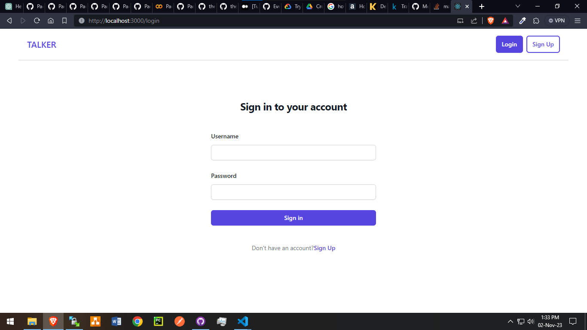
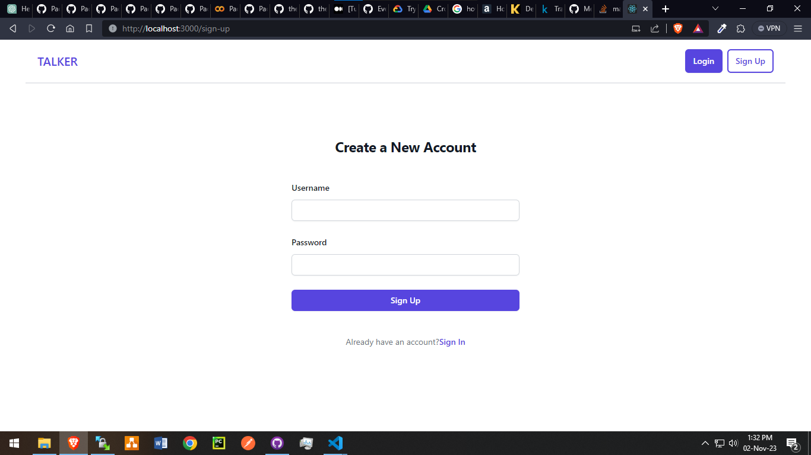
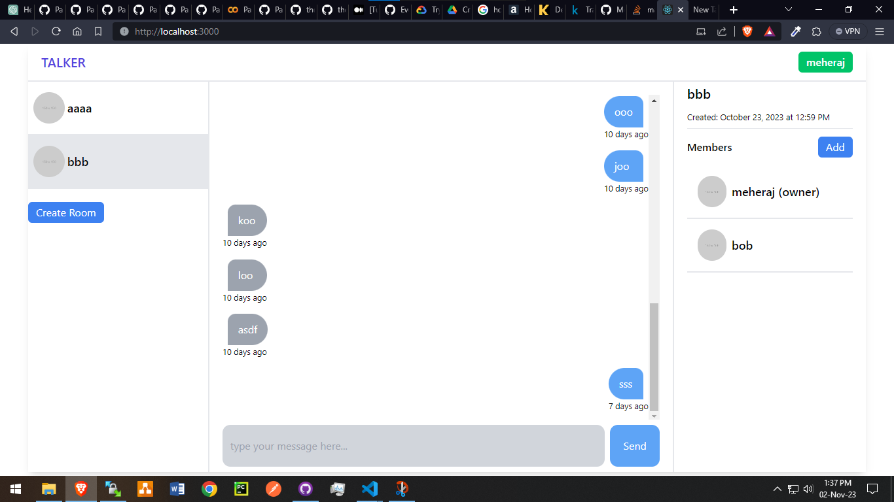

# Talker

Yet Another Chat App

## Features

-   [x] User Authentication
-   [x] Room Creation
-   [ ] Room Managemnt
-   [x] Member Add/Remove
-   [ ] User Management

## Tech Stack

**Client:** React, TailwindCSS

**Server:** Node, Express

**Database:** Mongodb

## Environment Variables

To run this project, you will need to add the following environment variables to your .env file

`MONGO_URI`

`LOCAL_MONGO_URI`

`PORT`

`JWT_SECRET`

## Installation

-   Clone the project from GitHub

```bash
git clone https://github.com/MeherajUlMahmmud/Talker-Web.git
```

-   Go into `CLIENT` folder and `SERVER` folder from different terminals

```bash
cd client
```

```bash
cd SERVER
```

-   Install dependencies in both application

```bash
npm install
```

-   Add `ENV_VARIABLES` in the `SERVER` app

```bash
MONGO_URI=
LOCAL_MONGO_URI=mongodb://localhost:27017/talker
PORT=8000
JWT_SECRET=
```

-   Run both applications

```bash
npm start
```

## Authors

-   [@MeherajUlMahmmud](https://www.github.com/MeherajUlMahmmud)

## License

[MIT](LICENSE)

## Screenshots

| Login Page                               | Sign Up Page                                           |
| ---------------------------------------- | ------------------------------------------------------ |
|  |  |
| Home Page                                | Profile Page                                           |
|    |            |
